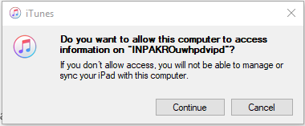
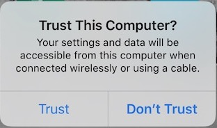
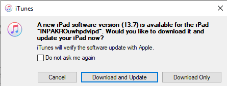
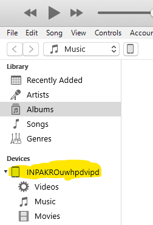
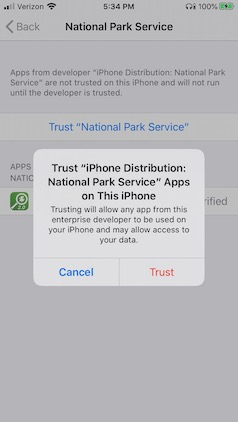
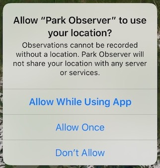
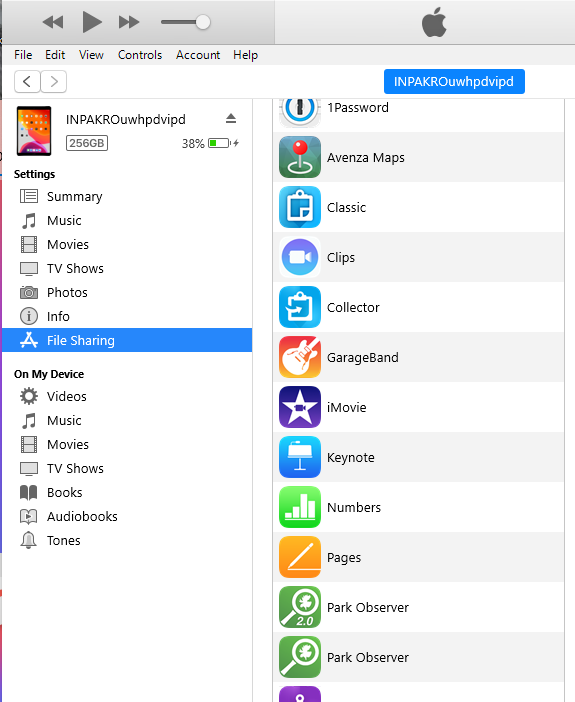
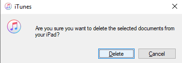

# Installing iTunes on your PC

**BE WARNED:** Getting iTunes installed and working correctly with the NPS/DOI software settings
can be the most troublesome part of working with Park Observer.  Please read these instructions
carefully.  The biggest source of trouble is using a version of iTunes that is incompatible with
our network -- it may run, but doesn't connect correctly to your device, or does not allow
application installation or file transfer.

iTunes is a software application that runs on the PC to allow you to connect to your iOS device.
You do not need an Apple Account, the Apple store, the music store or any thing else on-line.
The functionality you need has nothing to do with music, so ignore everything you might know about iTunes.

These instructions were written on September 2, 2020 with the following versions of software:

  * Windows 10 version 1809
  * iTunes 12.10.8.5

It is likely that these instructions will work with earlier versions of windows 10,
but not earlier versions of iTunes, so don't bother trying.
They may work with newer versions as well.  If not, please contact us (see below),
and let us know which versions are not working for you.  We
will investigate and update these instructions as necessary.

To check your windows version:
  - click the start menu
  - type winver
  - press the enter key

[image](start menu)
[image](winver)

To check 
Do you have itunes already installed?
 - click the windows icon, type itunes
   - if you see an option to download/install from web, you do not have it installed
  - If you have itunes installed
    - uninstall it
      - control panel
        - program and features, sort by publisher (look for Apple and remove all Apple software)
    - check:
     - you only need to do the following if your version of itunes does not work correctly
     - you should test before uninstalling and reinstalling

DO NOT Install itunes from the Apple website, This requires admin privileges, and is incompatible
with the NPS settings for windows.

Check the software center (start menu, type software, then return).  You should be on the VPN to
see all the applications available in the software center.  If iTunes is in the
list of Applications, then try installing from the software center.  If it is not there
then **disconnect from the VPN** and install from the Windows Store. You NPS username is now registered with the
windows store by virtue of our new (outlook) email system.  You do not need to be on the
VPN to install from the windows store.

If you are on the VPN, you may be able to launch the 

Click the start menu, type store, then return  (This does not work when on the VPN)

If you have logged in to the windows tore, you will be taken directly to the list of 
DOI applications. If not, you will need to log in with your network username (email address)
This will take you to the "Organizations sign on page"

Scroll down and look for the option to sign in with you PIV card.  If not there, then
sign in with your windows credentials and network password (This is the one you change every
2 months, and hardly ever use)  Enter the username and password, then press next.  This should
say "For security reasons we require additional information to verify your account"  Scroll down
and click the option "Sign in with PIV card".  Make sure your card is in the computer and enter you
PIN when prompted.

You should now be logged into Microsoft Store and see the list of DOI approved Apps.
iTunes is in that list.  Click on the iTunes icon to install it.

When the download is complete you will get a notification in the lower right.  click it to launch itunes

Accept the license agreement and itunes should launch.

Click **No Thanks** on the welcome screen
[image]

Ignore the options to go to or sign in the the iTunes store.

You do not need to log into the Apple Store, the iTunes store, or any other service

Use your browser to login to the windows store website (https://www.microsoft.com/en-us/store/apps/windows)
You may log in automatically if you are using the same browsers that is logged into teams or outlook.

If you are not signed in, use the sign in button at the top right

Then sign in with yor network account  

Search for [image] and (link) and repair

# Connecting your device to iTunes

*If you get any errors in this process and you cannot see your device in iTunes,
the first thing to suspect is the version of iTunes on your PC.
Please check the help page on [Installing iTunes](#install-itunes) to ensure
you are using the correct version.  Delete and reinstall
iTunes (**per the instructions!**) before continuing.*

Use a USB to lightning (charging) cable to connect your device to the PC.
The first time you connect your device, you will see a notification that
iTunes is setting up your device. You will see another notification when it is done.

You will be asked if you want to allow the computer to access the device.
Make sure your device is on and unlocked.

Then click `continue`.

You will be prompted on your device to trust the computer.

Tap on `Trust` and enter your device pass code.

You may then get prompted by iTunes to upgrade your device.

I encourage you to keep your device up to date, however you can skip this step
(click `cancel`) and upgrade your device later if you want.
I prefer to upgrade my device over WiFi, and not via iTunes.

If your device is successfully connected to iTunes, you will see a mobile device
icon in the top left of the iTunes screen

You are now ready to [Install Park Observer](#install-app),
or [Install Additional Files](#add-files)
after Park Observer has already been installed.

# Installing Park Observer

* You will need to download the installation file (*.ipa) from the downloads
page to your desktop (or folder of your choice).
* Ensure that your device is on and unlocked.
* Start iTunes on your PC: Start menu, type itunes, press enter key
* Connect your device to the PC.
  If you have trouble with this step, please check your version of iTunes
  and the instructions for [Installing iTunes](#install-itunes),
  and [connecting your device to the PC](#connect-device)
* Drag the installation (*.ipa) file from your windows desktop (or folder of your choice)
to the name of your device in the table of contents in iTunes.

 
This area will get a blue halo when the drop will work and the dragged file will
display `Link` when it can be dropped. The dragged file will show a red "no entry"
circle ( 🚫) when it cannot be dropped. It is not enough just to see the `Link` text,
because that will appears when you are over other parts of the screen.
You need to see the blue highlight of your device name.

Dropping the install file on the device in iTunes will begin the installation.

If it complete successfully, you will have a Park Observer 2.0 icon 
on your device (check all the screens if you do not see it).

You can now [disconnect your device](#disconnect-device).

# Launching Park Observer

Tap the Park Observer 2.0 icon  on your device.

If this is a first install of Park Observer you will see this warning

In order for Park Observer to run on your device you must trust the developers
at the National Park Service.  You only need to do this once, so you will not see
this warning if you have Park Observer 1.x or 2.x) already installed.

To enable Park Observer, you must have internet access. The trust process requires
validating the developer certificates in Park Observer with Apple's servers.  Typically
you cannot access Apple's servers from the Arrowhead WiFi, so if the following step
fails, then either 1) turn off WiFi and use cellular data (if available on your device),
or 2) connect to different WiFi (home, cafe, airport, etc.) and try again.

  1. Launch the Settings app 
  2. Select `General`
  3. At the bottom of the list, tap on `Device Management`, then `National Park Service`

   
  
  4. Then tap on `Trust "National Park Service"`
  5. In the pop up alert box, tap on `Trust`

  

  6. This should complete the trust process.  Return to the home screen and 
  try running Park Observer again.

If Park Observer launches successfully, you should see a screen like this:

 
 
On the first tap
of the `start track log` button 
or the `GPS` Button ,
you will be prompted to allow location services.

You should tap `Allow While Using App`.
Park Observer expects to use your GPS, and functionality will be greatly limited
without location services.

If you enable background track logging (in the settings menu) you will be prompted again.

Select `Change to Always Allow`.  You may get prompted again in a few days to confirm that you
are still OK with background location data collection. You can change your
choice at any time in the settings application, and Park Observer should respond accordingly, however
you may lose functionality.

At this point you might want to [load your own protocols and basemaps](#add-files),
or begin playing with the sample survey (See [Getting Started](link) for help).

# Adding Files to Park Observer

**NOTE:** You will not be able to add files until Park Observer has run at least once.

The process is the same for 

* Basemap tile package (*.tpk) files
* Existing survey archive (*.poz) files
* Survey protocol (*.obsprot) files

You can download [protocols](link) and [basemaps](link) from this website, 
or you can make your own [protocols](link) and [basemaps](link).  The files you
wish to add to Park Observer will need to be on your PC.

To add any of these file to Park Observer

1. Download or create the files on your PC.
2. Ensure that your device is on and unlocked.
3. Start iTunes on your PC: Start menu, type itunes, press enter key
4. Connect your device to the PC.
   If you have trouble with this step, please check your version of iTunes
   and the instructions for [Installing iTunes](#install-itunes),
   and [connecting your device to the PC](#connect-device)
5. Tap on the device icon in iTunes

and you will see the device details

6. Tap on File Sharing

7. Tap on Park Observer 2.0 icon to see the list of Park Observer Documents

8. Select the file(s) in windows file explorer that you want to add to Park Observer
  and drag and drop them onto the list of files in iTunes.  The list of files should highlight
with a blue focus ring, and display `link` when the files can be dropped. 

9. When you "drop" the files they will be copied to the device. If the files already exist
on your device, you will be warned:

select your preferred option to continue.

[Disconnect your device](#disconnect-device) when you are done adding files.

# Removing files from Park Observer

Follow steps 2 through 7 in [Adding Files to Park Observer](#add-files).

To copy files from your device to the PC, select the files you want in the list of
Park Observer Documents in iTunes and drag/drop them onto your windows desktop,
or a folder of your choice.

To delete files from Park Observer with iTunes, select the files and press
the delete key on your keyboard. 
You will be warned

Click `Delete` to delete the files or `Cancel` to abort and leave the files on your device.

[Disconnect your device](#disconnect-device) when you are done deleting files.

# Disconnecting your device

To safely disconnect your device from iTunes, click on the device icon

Then click on the eject button

You can now disconnect the cable from the device and the PC.
